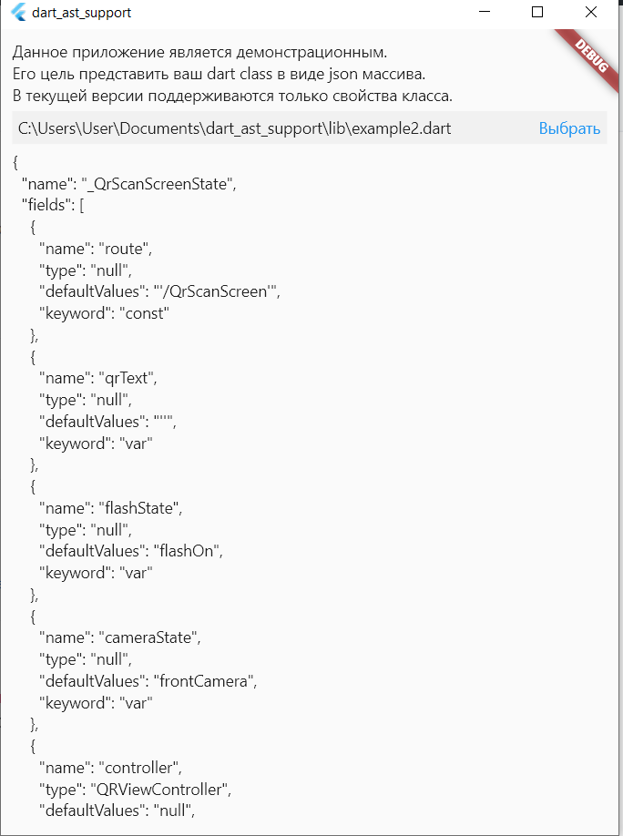

# DartAstSupport

Данное приложение является демонстрационным.

Его цель представить ваш dart class в виде json массива.

В текущей версии поддерживаются только свойства класса.

К проекту приложены демонстрационные файлы.
